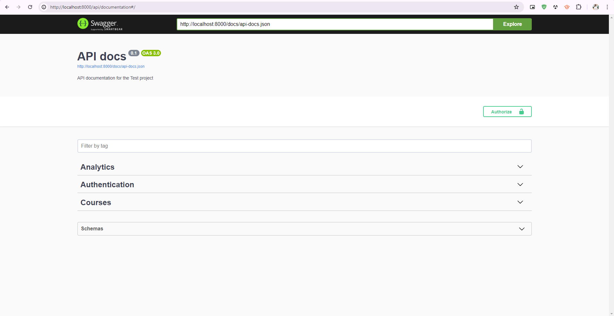
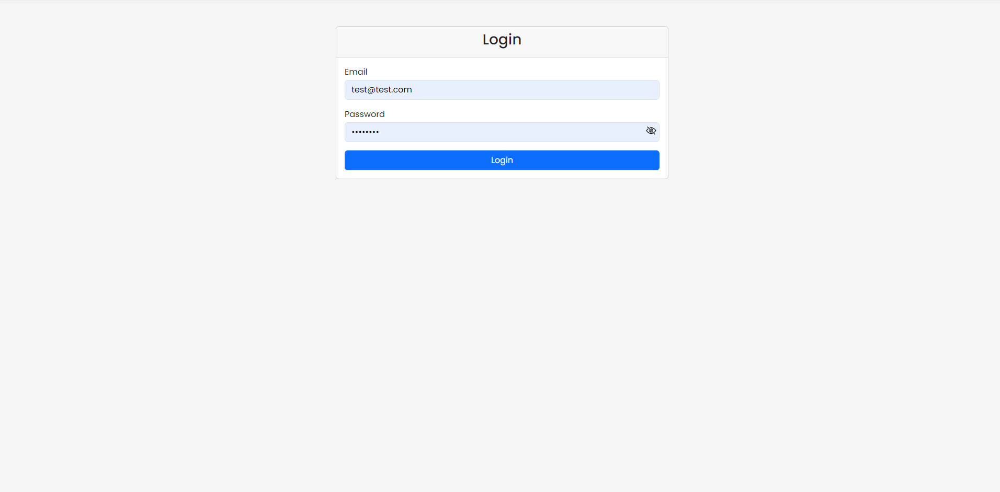
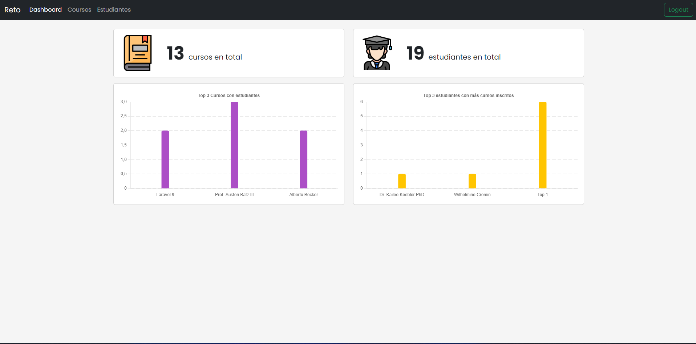
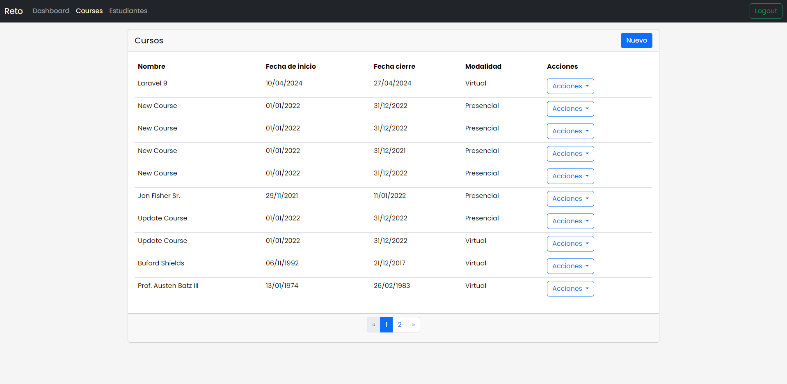
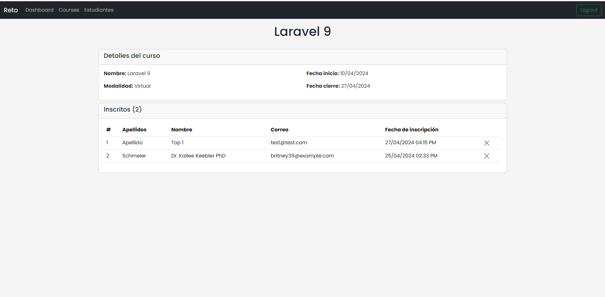
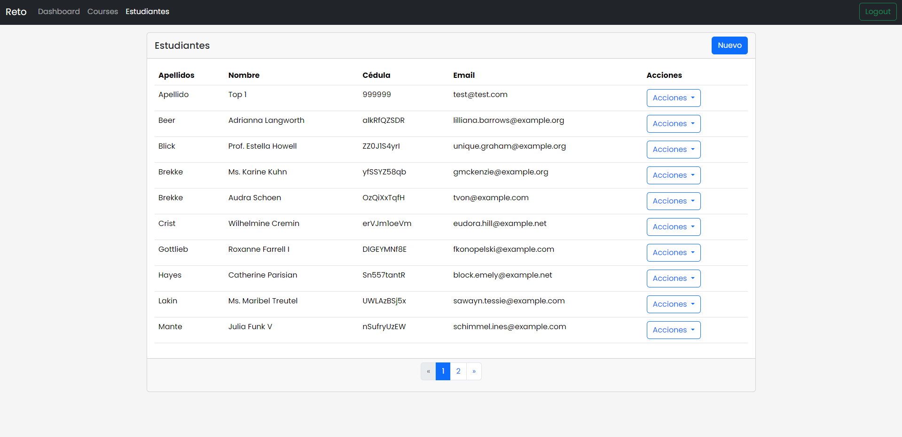
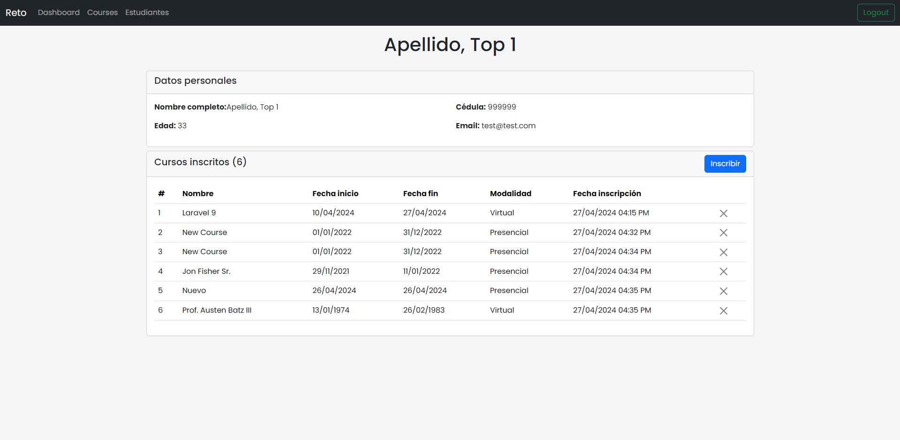
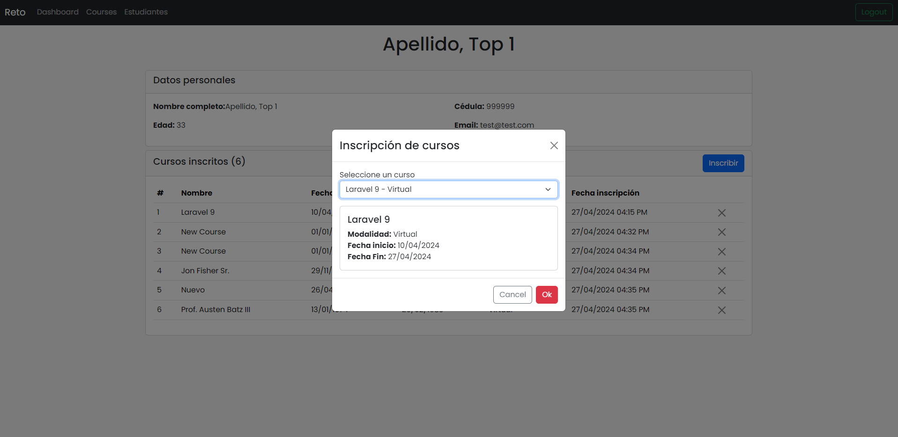

# Prueba técnica

Este proyecto fue creado con el propósito de realizar una prueba técnica.

## Backend

El backend fue desarrollado en Laravel 11 y se encuentra en la carpeta `backend`.

### Migraciones

```bash
cd backend
php artisan migrate
```

### Datos de prueba

```bash
php artisan db:seed
```

### Iniciar servidor

```bash
php artisan serve
```

### API Documentation

La documentación se realizó con Swagger y se encuentra en la siguiente ruta:

```
http://localhost:8000/api/documentation
```

#### Capturas

[//]: # (separador)

## Frontend

El frontend fue desarrollado en Angular 17 y se encuentra en la carpeta `frontend`.

### Instalar dependencias

```bash
cd frontend
npm install
```

### Iniciar servidor de desarrollo

```bash
ng serve
```

Abrir el navegador en la siguiente ruta:

```
http://localhost:4200
```

Run `ng serve` for a dev server. Navigate to `http://localhost:4200/`. The application will automatically reload if you
change any of the source files.

## Capturas

### Backend




### Frontend









## Autor

[//]: # (aLEXANDER RAMOS Y URL GITHUB)
Alexander Ramos - [Github](https://github.com/alexaderramos)
